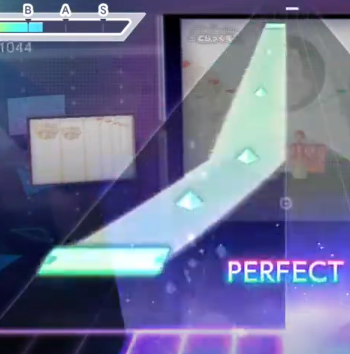
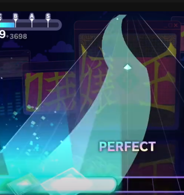

# Making Charts in Different Difficulties


The content on this page is incomplete. If you are able to help out, please consider [updating the article!](../contribute/)


***

## HARD

HARD levels generally focus on the main melody, not the underlying beat behind the vocals. Any underlying pattern may be replaced with hold note and visible hold mids.\
\
HARD charts, unlike EXPERT or MASTER, do not have tap notes accompanying the beginning or end of hold notes. When a hold note happens, no other notes will happen simultaneously, unless it is another hold note and they last the same amount of time. This also means generally, hold notes won't come one after the other.


嬢王 has an exception, with a critical tap accompanying the end of a hold note. It also has an exception with various "trace" hold notes coming one after the other around 1:25, but The EmpErroR also has that (picture shown soon).&#x20;


<figure><figcaption>
The EmpErroR HARD
</figcaption></figure>

 

<figure><figcaption>
嬢王 (Jouou) HARD
</figcaption></figure>

The end of hold notes lines up with the end of a lyric statement or beat. Directional flicks are not usually common. "Spam" parts have breaks in-between, and they're usually not too fast. If there is a fast part, it will be replaced by a hold note with hold mids/steps, or it will be relatively short.

<figure><figcaption>
初音ミクの激唱 HARD Example
</figcaption></figure>

***

## MASTER

When it comes to the difference between EXPERT and MASTER charts, the difference is not only generally higher difficulty, but patterns that are harder to read too because there are no limitations other than the difficulty of your chart. \
\
MASTER (and [APPEND](making-charts-in-different-difficulties.md#append)) charts are the only charts with cross-hand patterns, implying that your fingers cross over each other, but you can cheese those patterns. Regardless, they are still fun to play and interesting to watch.

<figure><figcaption>
嬢王 (Jouou) cross-hand pattern
</figcaption></figure>

***

## APPEND

APPEND is the 6th difficulty which features charts meant to be played with more than three fingers (\*). The notes usually comes in a 4-lane formation, hold notes usually end with a trace note, and occasional cross-hand patterns. \
\
**(\*)** _You can sorta use two fingers and achieve FC/AP if you're crazy enough to do so._

### Use different note types to determine finger placements

Place at least 2 different note types on a 3+ notes chord, this way the player knows what fingers to use with no guesswork involved when sightreading.\
\
Here, in the example below, it is obvious that you need to use 1 finger on the left hand to hit the short hold notes, and 2 finger on the right to hit the other.

<figure><figcaption></figcaption></figure>

### Cross-hand patterns: Make it fun

While cross-hand patterns can be done without crossing hands, it can be very satisfying to hit if it's made in a way that flows well. \
\
Experienced charters usually take finger's inertia into consideration when placing notes in the example below, so that each taps change hand positions in an natural way, creating that flow sensation.

<figure><figcaption>
Cross-hand example (Blue: Left, Red: Right)
</figcaption></figure>
