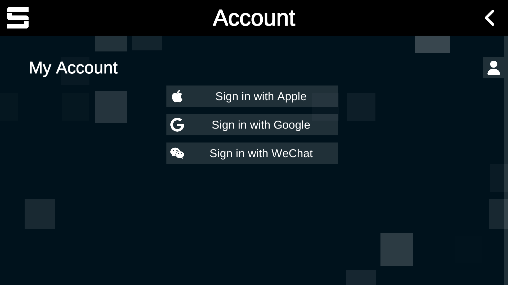

# (WIP) Charting Tutorial


The content on this page is incomplete. If you are able to help out, please consider [updating the article!](../contribute/)


## I. Preparations

## II. Making a chart

## III. Upload your chart

### 0. Register a Sonolus account in your device.

Press the "Account" button and sign in.

<figure><figcaption></figcaption></figure>

 

<figure><figcaption></figcaption></figure>

### 1. Log in to Chart Cyanvas

